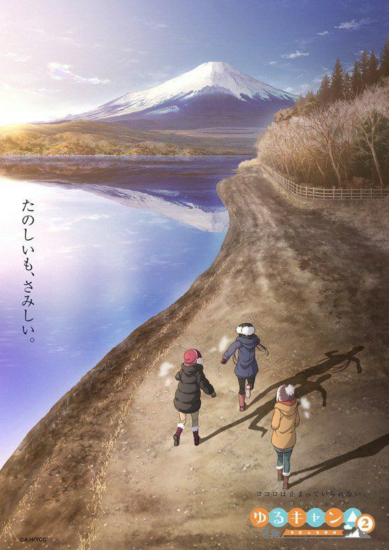
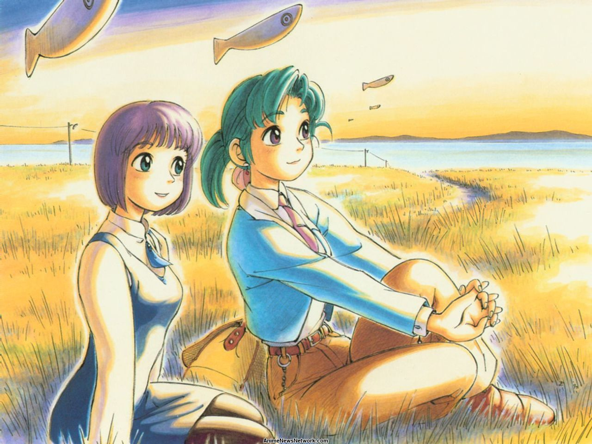
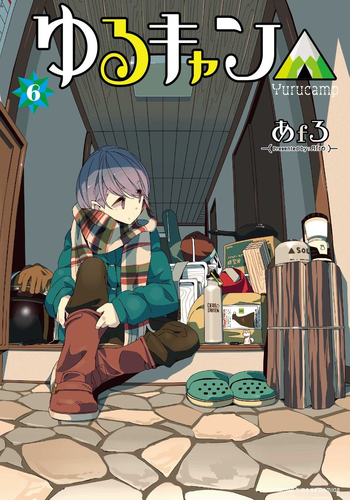

# awesome-iyashikei-sources 

Iyashikei(癒し系) is a specific genre to Japanese works, primarily manga and anime.It is a sub-genre of slice of life, portraying characters living out peaceful lives in calming environments, and is intended to have a healing effect on the audience.

iyashi(癒し) means "healing", kei(系) means "system" and together (癒し系) means "healing type".

### Motivation

* Since there are many otaku developers who exhausted from coding works and other workloads, iyashikei is basically mental therapy for them.
* Unlike other genres,iyashikei usually tend to overlook from most audiences,this repo act as a collection that doesn't need to search for.

### Anime

| Name | Picture |
| --- | --- |
| **Laid-Back Camp** | 

 |
| **Laid-Back Camp 2nd Season** | 

 |
| **Yokohama Kaidashi Kikou** | 

 |

### Manga

| Name | Picture |
| --- | --- |
| **Laid-Back Camp** | 

 |
| **Yokohama Kaidashi Kikou** | 

 |

### SoundTrack
| Link |
| --- |
| [ゆるキャン🔺 - ソロ星空のすすめ BGM](https://youtu.be/nzfk0VrDt7I) |
| [Yuru Camp△ OST](https://youtu.be/0cs_wheBIvs) |
